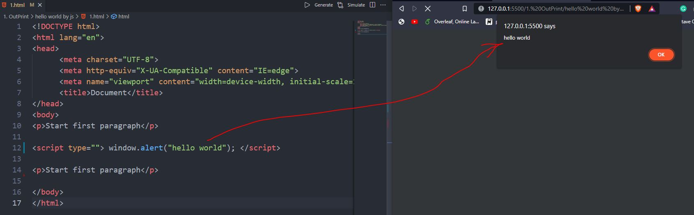
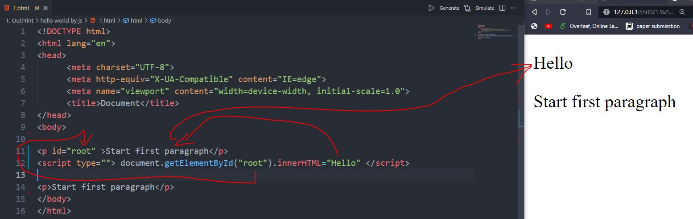
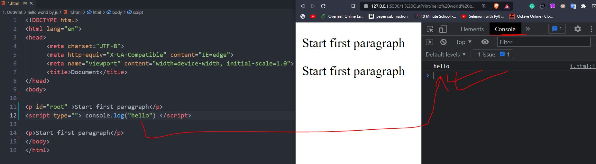

# 4 basic methods:

## 1. window.alert() 
```
<script type=""> window.alert("hello world"); </script>
// or (same)
<script type=""> alert("hello world"); </script>
```

<hr>

## 2. document.write()
```
<script type=""> document.write("hello world"); </script>
```

<hr>

## 3. innerHTML
```
<body>
<p id="root" >Start first paragraph</p>
<script type=""> document.getElementById("root").innerHTML="Hello" </script>
// meaning: document = from html document, find the element which id is 'root', and put the txt 'Hello' to that Html tag.
</body>
```

<hr>

## 4. console.log()
```
<body>

<p id="root" >Start first paragraph</p>
<script type=""> console.log("hello") </script>

<p>Start first paragraph</p>
</body>
```

<hr>

